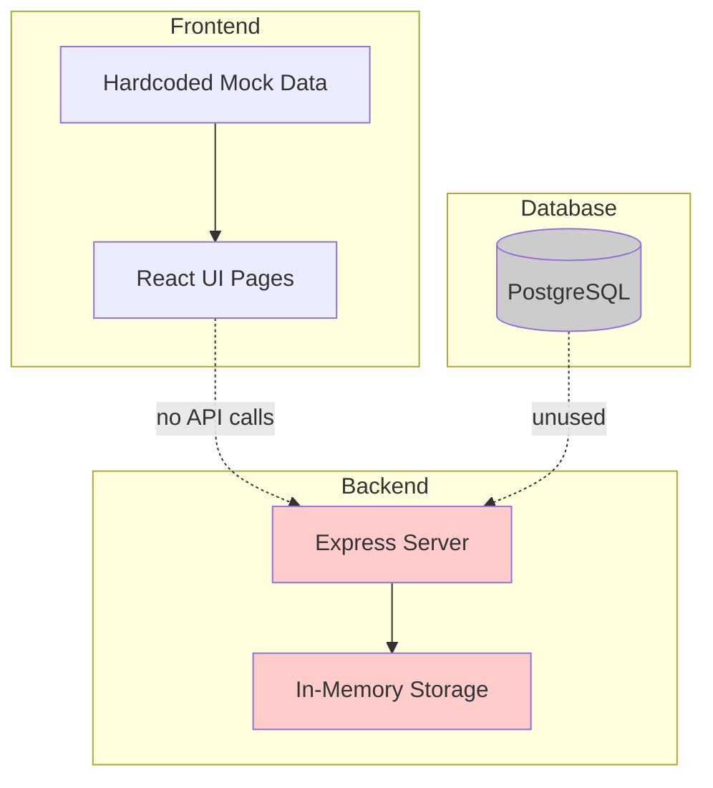
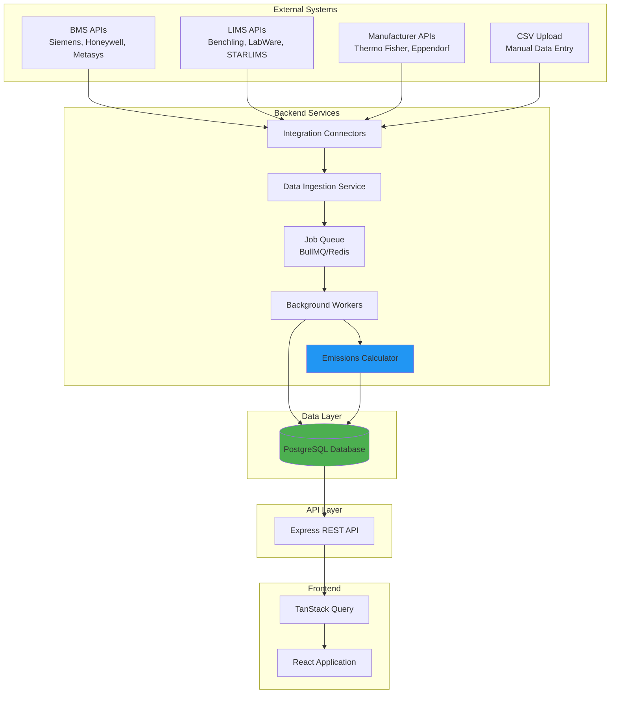
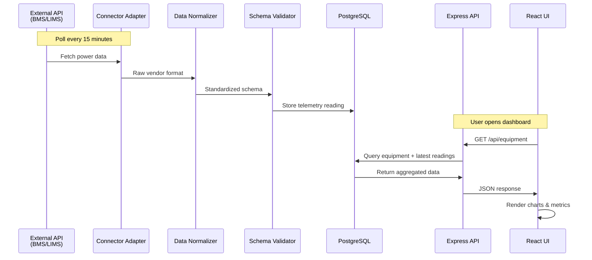
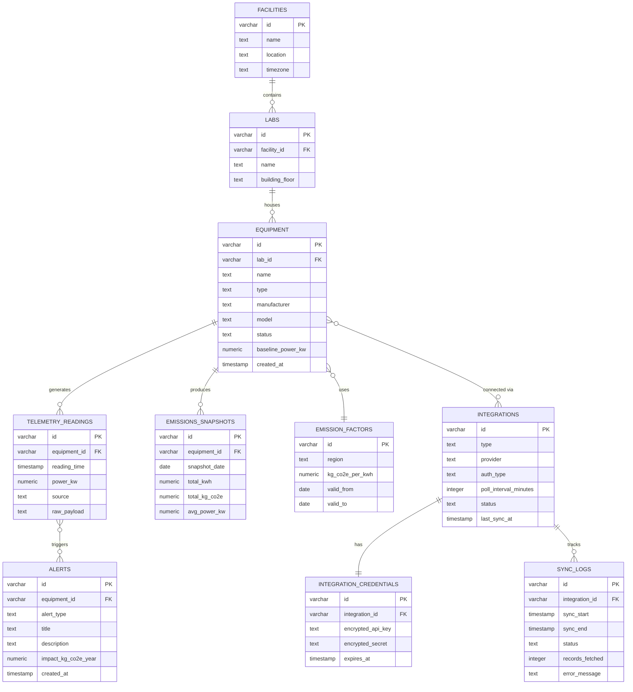

# 🧬 Green Bio Compute Platform - Complete Project Recap

**Date:** October 22, 2025  
**Repository:** https://github.com/mulbagalamaq/Green_BioCompute  
**Status:** Early Development (UI Prototype Phase)

---

## 📊 Current State: Where We Are

### ✅ **What's Implemented**

#### **Frontend (100% Mock Data)**
- ✅ Dashboard page with 4 metric cards
- ✅ Equipment inventory page with search & details modal
- ✅ Integrations page showing API connection status
- ✅ Analytics, Reports, Settings pages (placeholder)
- ✅ Sidebar navigation with theme toggle
- ✅ Complete shadcn UI component library
- ✅ Responsive layout (mobile → desktop)
- ✅ Dark mode support (theme provider configured)

#### **Infrastructure**
- ✅ React 18 + TypeScript + Vite
- ✅ Express backend server (empty)
- ✅ PostgreSQL database available (unused)
- ✅ Drizzle ORM configured
- ✅ TanStack Query setup
- ✅ Git repository connected to GitHub

### ❌ **What's NOT Implemented**

#### **Critical Gaps**
- ❌ **No backend API routes** (server/routes.ts is empty)
- ❌ **No database schema** (only users table exists)
- ❌ **No real data** (everything is hardcoded mock data)
- ❌ **No API integrations** (BMS, LIMS, manufacturer APIs)
- ❌ **No data persistence** (using MemStorage, not PostgreSQL)
- ❌ **No authentication** (user login not implemented)
- ❌ **No polling service** (no background jobs)
- ❌ **No emissions calculations** (formula exists but not coded)
- ❌ **No CSV import** (manual data entry not built)
- ❌ **No websockets** (no real-time updates)

#### **Technical Debt**
- All pages use `mockData` constants
- Storage layer is in-memory (loses data on restart)
- No shared types between frontend/backend
- Design guidelines partially implemented (colors need work)
- No error handling or loading states
- No data validation

---

## 🎯 What We're Hoping to Achieve

### **Vision**
Build a **zero-IoT sensor platform** that tracks laboratory equipment emissions by pulling data from existing systems (BMS, LIMS, manufacturer clouds) to provide actionable sustainability insights for biotech enterprises.

### **Core Value Proposition**
1. **No new hardware required** - Use existing API integrations
2. **Unified emissions view** - Combine wet lab + dry lab data
3. **Actionable insights** - Predictive maintenance alerts, consolidation opportunities
4. **Compliance ready** - GHG Protocol, ISO 14064, CSRD reporting
5. **Real-time monitoring** - Live equipment status & power consumption

### **Target Users**
- Laboratory managers
- Sustainability officers
- Facility operations teams
- Biotech enterprises (pharma, research institutions)

---

## 🏗️ Architecture Diagrams

### **Current State (Prototype)**


### **Planned Architecture (Production)**


### **Data Flow: API Integration Pipeline**


### **Database Schema (Planned)**


---

## 🛠️ Technology Stack Analysis

### **Current Stack**

| Layer | Technology | Status | Assessment |
|-------|-----------|--------|------------|
| **Frontend** | React 18 + TypeScript | ✅ Good | Modern, strong typing, excellent DX |
| **UI Library** | Shadcn UI + Tailwind | ✅ Excellent | Accessible, customizable, consistent |
| **Routing** | Wouter | ✅ Good | Lightweight (1.3KB), sufficient for SPA |
| **Data Fetching** | TanStack Query v5 | ✅ Excellent | Best-in-class caching, optimistic updates |
| **Build Tool** | Vite | ✅ Excellent | Fast HMR, optimized builds |
| **Backend** | Express + TypeScript | ⚠️ Adequate | Simple but lacks structure for complex features |
| **ORM** | Drizzle | ✅ Good | Type-safe SQL, good Postgres support |
| **Database** | PostgreSQL (Neon) | ✅ Excellent | Reliable, ACID, JSON support, serverless |
| **Validation** | Zod | ✅ Excellent | Runtime + compile-time validation |
| **Background Jobs** | ❌ Missing | 🔴 Critical | Need node-cron or BullMQ for polling |

### **Stack Pros & Cons**

#### ✅ **Strengths**
- **Strong typing** across entire stack (TypeScript + Zod + Drizzle)
- **Modern DX** with hot reload, instant feedback
- **Shared types** via `@shared/schema.ts` eliminates API contract bugs
- **Component library** (shadcn) accelerates UI development
- **PostgreSQL** handles complex relational data well
- **Lightweight** (wouter vs react-router saves 10KB)

#### ⚠️ **Weaknesses**
- **Express lacks structure** - No dependency injection, manual routing, no built-in scheduler
- **No background job runner** - Can't poll external APIs without adding node-cron/BullMQ
- **No real-time capabilities** - Would need to add WebSockets or Server-Sent Events
- **Manual glue code** - Have to wire up validation, error handling, logging ourselves

### **Alternative Implementations**

#### **Option 1: Next.js/Remix (Full-Stack Framework)**
```
Pros:
✅ Server actions for tight frontend-backend coupling
✅ Built-in API routes with better structure
✅ SSR/SSG for better SEO (not critical for internal tool)
✅ File-based routing

Cons:
❌ More opinionated (less flexibility)
❌ Heavier bundle size
❌ Overkill for internal dashboard
❌ Replit deployment more complex

Verdict: ❌ Not recommended - we don't need SSR
```

#### **Option 2: NestJS Backend (Instead of Express)**
```
Pros:
✅ Dependency injection & modules
✅ Built-in scheduler (@nestjs/schedule)
✅ TypeScript-first with decorators
✅ Better architecture for complex services
✅ Built-in validation, logging, error handling

Cons:
❌ Steeper learning curve
❌ More boilerplate initially
❌ Larger bundle size
❌ Slower cold starts

Verdict: ⚠️ Consider if project scales beyond MVP
```

#### **Option 3: Serverless Functions (Connector Services)**
```
Pros:
✅ Each integration is an isolated function
✅ Auto-scaling based on load
✅ No server management
✅ Pay-per-execution

Cons:
❌ Cold start latency (2-5 seconds)
❌ Complex local development
❌ Vendor lock-in (AWS Lambda, Vercel, etc.)
❌ Harder to debug

Verdict: ❌ Not recommended for MVP - adds complexity
```

#### **Option 4: BullMQ + Redis (Background Jobs)**
```
Pros:
✅ Robust job queue with retries
✅ Distributed workers
✅ Job prioritization & rate limiting
✅ Dashboard for monitoring

Cons:
❌ Requires Redis server
❌ More infrastructure complexity
❌ Overkill for simple 15-min polling

Verdict: ⚠️ Start with node-cron, upgrade to BullMQ if needed
```

### **Recommended Stack** (Keep Current + Add Job Scheduler)

```
Frontend:  React + Vite + Shadcn UI + TanStack Query ✅
Backend:   Express + TypeScript ✅
ORM:       Drizzle ✅
Database:  PostgreSQL ✅
NEW:       node-cron (background polling) ⚡ ADD THIS
NEW:       crypto (encrypt API credentials) ⚡ ADD THIS
Future:    BullMQ + Redis (when scaling) 🔮
```

---

## 🔄 Data Flow Analysis

### **Current Flow (Mock Data)**
```
1. User opens Dashboard
2. React component imports mockEmissionsData
3. Component renders charts with hardcoded values
4. No API calls made
5. Data lost on page refresh (no persistence)
```

### **Planned Flow (Production)**

#### **Integration → Database Flow**
```
Every 15 minutes (configurable per integration):

1. node-cron triggers job
2. Connector fetches data from external API
   - BMS API: Power consumption readings
   - LIMS API: Equipment usage logs
   - Manufacturer API: Equipment status
3. Adapter normalizes vendor-specific format
4. Validator checks schema (Zod)
5. Upsert to PostgreSQL:
   - TelemetryReadings (timestamped metrics)
   - SyncLogs (success/failure tracking)
6. Emissions calculator runs daily:
   - Query TelemetryReadings for day
   - Join with EmissionFactors
   - Calculate: kWh × kg CO₂e/kWh
   - Store in EmissionsSnapshots
7. Alert engine checks thresholds:
   - Power consumption >15% above baseline → Alert
   - Equipment offline >2 hours → Alert
```

#### **Database → UI Flow**
```
User opens Dashboard:

1. React Query executes:
   GET /api/equipment
   GET /api/emissions/monthly
   GET /api/alerts
   
2. Express API queries PostgreSQL:
   - JOIN Equipment + LatestTelemetry
   - Aggregate EmissionsSnapshots by month
   - Fetch unresolved Alerts
   
3. API returns JSON with typed responses
4. React Query caches data (5 min TTL)
5. UI renders charts & metrics
6. Auto-refetch on:
   - Window focus
   - Network reconnect
   - Manual refresh
```

---

## 💾 Database: PostgreSQL vs In-Memory

### **Why PostgreSQL is Required**

| Requirement | In-Memory | PostgreSQL |
|------------|-----------|------------|
| Data persistence across restarts | ❌ | ✅ |
| Multi-user access | ❌ | ✅ |
| Complex joins (equipment + telemetry) | ⚠️ Slow | ✅ Fast |
| Time-series queries | ❌ | ✅ Optimized |
| ACID transactions | ❌ | ✅ |
| Audit trail | ❌ | ✅ |
| Regulatory compliance | ❌ | ✅ |
| Data export (CSV, PDF) | ⚠️ Manual | ✅ Built-in |

### **Decision: Use PostgreSQL**

**Reasoning:**
- Equipment emissions are **historical data** (need persistence)
- Multiple users need concurrent access
- Regulatory reporting requires audit trails
- Time-series queries for trends
- Already have Neon Postgres configured

**Migration Path:**
1. Define Drizzle schema in `shared/schema.ts`
2. Run `npm run db:push` to create tables
3. Update storage interface to use Drizzle queries
4. Replace MemStorage with DbStorage

---

## 🔌 API Integration Strategy

### **Hybrid Approach: Webhooks + Polling**

| Integration Type | Method | Interval | Rationale |
|-----------------|--------|----------|-----------|
| **BMS (Metasys, Siemens)** | Polling | 15 min | No webhook support |
| **LIMS (Benchling)** | Webhooks | Real-time | Supports SSE/webhooks |
| **Manufacturers** | Polling | 30 min | Limited API access |
| **CSV Upload** | Manual | On-demand | Fallback for offline equipment |

### **Polling Architecture (node-cron)**
```typescript
import cron from 'node-cron';

// Poll Metasys BMS every 15 minutes
cron.schedule('*/15 * * * *', async () => {
  const integrations = await getActiveIntegrations('bms');
  for (const integration of integrations) {
    await pollMetasysAPI(integration);
  }
});

// Calculate daily emissions at midnight
cron.schedule('0 0 * * *', async () => {
  await calculateDailyEmissions();
});
```

### **Credential Management (Encrypted Storage)**
```typescript
import crypto from 'crypto';

// Encrypt API keys before storing
function encryptCredential(apiKey: string): string {
  const algorithm = 'aes-256-gcm';
  const key = Buffer.from(process.env.ENCRYPTION_KEY!, 'hex');
  const iv = crypto.randomBytes(16);
  const cipher = crypto.createCipheriv(algorithm, key, iv);
  
  let encrypted = cipher.update(apiKey, 'utf8', 'hex');
  encrypted += cipher.final('hex');
  const authTag = cipher.getAuthTag().toString('hex');
  
  return `${iv.toString('hex')}:${authTag}:${encrypted}`;
}
```

---

## 📋 Implementation Roadmap

### **Phase 1: Foundation** (Week 1-2) - **HIGH COMPLEXITY**

**Goal:** Replace mock data with real database

**Tasks:**
1. ✅ Define database schema in `shared/schema.ts`
   - Equipment, Integrations, TelemetryReadings, EmissionsSnapshots
2. ✅ Run database migration: `npm run db:push`
3. ✅ Update storage interface (IStorage) with CRUD methods
4. ✅ Implement DbStorage using Drizzle queries
5. ✅ Create Express API routes:
   - GET /api/equipment
   - POST /api/equipment
   - GET /api/integrations
   - POST /api/integrations/test-connection
6. ✅ Wire frontend to API with TanStack Query
7. ✅ Remove all mock data imports
8. ✅ Add loading/error states to UI

**Acceptance Criteria:**
- Dashboard shows real equipment from database
- Can add new equipment via UI → saves to Postgres
- Integrations page shows actual connection status

---

### **Phase 2: API Integrations** (Week 3-4) - **HIGH COMPLEXITY**

**Goal:** Pull data from external systems

**Tasks:**
1. ✅ Install node-cron for scheduling
2. ✅ Build connector framework:
   - Base connector class
   - Credential encryption/decryption
   - Error handling & retries
3. ✅ Implement BMS connectors:
   - Johnson Controls Metasys (OAuth 2.0)
   - Siemens Desigo (NORIS API)
   - Honeywell Niagara 4 (REST modules)
4. ✅ Implement LIMS connector:
   - Benchling (Python SDK or REST)
5. ✅ Build generic REST connector:
   - Configurable endpoints
   - Custom authentication
6. ✅ CSV import endpoint:
   - File upload
   - Parse & validate
   - Bulk insert to database
7. ✅ Create polling jobs:
   - Schedule per integration
   - Store telemetry readings
   - Log sync status

**Acceptance Criteria:**
- Metasys integration pulls power data every 15 min
- Benchling connector fetches equipment usage logs
- CSV upload works for manual data entry
- Sync logs show success/failure with timestamps

---

### **Phase 3: Analytics & Calculations** (Week 5) - **MEDIUM-HIGH**

**Goal:** Calculate emissions and generate insights

**Tasks:**
1. ✅ Emissions calculation engine:
   - Query telemetry readings
   - Apply emission factors
   - Generate daily snapshots
2. ✅ Alert generation pipeline:
   - Detect power consumption spikes
   - Equipment offline detection
   - Consolidation opportunities
3. ✅ Real-time updates:
   - WebSocket or polling for dashboard
   - Connection health monitoring
4. ✅ Update dashboard:
   - Replace mock charts with real data
   - Add date range filters
   - Export to CSV

**Acceptance Criteria:**
- Dashboard shows actual emissions calculated from telemetry
- Alerts appear when equipment power exceeds baseline by 15%
- Monthly trend chart reflects real data
- Equipment breakdown chart shows top emitters

---

### **Phase 4: Polish & Production** (Week 6) - **MEDIUM**

**Goal:** Production-ready features

**Tasks:**
1. ✅ Dark mode color tokens (fix red placeholders in index.css)
2. ✅ Authentication (user login/logout)
3. ✅ Audit trails (who changed what)
4. ✅ Settings page (user preferences, facility config)
5. ✅ Reports page (GHG Protocol export)
6. ✅ Error boundaries & fallbacks
7. ✅ Performance optimization
8. ✅ E2E testing with Playwright

**Acceptance Criteria:**
- Users can log in and see their facility's data
- Settings page allows configuring emission factors
- Reports export to PDF with compliance formats
- No console errors or crashes

---

## 🚀 What to Build Next

### **Priority Order**

1. **Database Schema** (Critical blocking item)
   - Define all tables in `shared/schema.ts`
   - Run migration
   - Unlocks all other work

2. **Storage Layer** (Enables data persistence)
   - Switch from MemStorage → DbStorage
   - Implement Equipment CRUD
   - Implement Integration CRUD

3. **Express API Routes** (Connects frontend to backend)
   - GET /api/equipment
   - POST /api/equipment
   - GET /api/integrations
   - POST /api/integrations/test

4. **Frontend Wiring** (Remove mock data)
   - Update Dashboard to use TanStack Query
   - Update Equipment page
   - Update Integrations page

5. **Background Jobs** (API polling)
   - Install node-cron
   - Build connector framework
   - Implement Metasys connector first (most common BMS)

---

## 🎨 Design System Status

### **Implemented**
- ✅ Shadcn UI components
- ✅ Tailwind CSS
- ✅ Theme provider (dark mode toggle)
- ✅ Responsive layouts

### **Not Implemented**
- ❌ Color tokens (still using `red` placeholders in index.css)
- ❌ Typography scale (need to define font sizes)
- ❌ Spacing primitives (need consistent units)

**Action Required:** Update `client/src/index.css` with design_guidelines.md colors

---

## 📊 Estimated Complexity

| Phase | Estimated Effort | Risk Level |
|-------|-----------------|------------|
| **Phase 1: Foundation** | 40-60 hours | Medium (database migrations can be tricky) |
| **Phase 2: Integrations** | 60-80 hours | High (external APIs, auth, error handling) |
| **Phase 3: Analytics** | 30-40 hours | Medium (calculations straightforward) |
| **Phase 4: Polish** | 20-30 hours | Low (UI enhancements) |
| **TOTAL** | **150-210 hours** | **~4-6 weeks** |

---

## 🔍 Critical Decisions Needed

### **1. Stick with Express or Migrate to NestJS?**
**Recommendation:** Stick with Express for now
- Simpler for MVP
- Can refactor later if complexity grows
- NestJS adds 2-3 weeks to timeline

### **2. Use node-cron or BullMQ?**
**Recommendation:** Start with node-cron
- Simple 15-min polling doesn't need queue
- Upgrade to BullMQ if we need:
  - Job prioritization
  - Distributed workers
  - Advanced retry logic

### **3. Polling Interval?**
**Recommendation:** 15 minutes (configurable per integration)
- BMS data: 15 min (power consumption changes slowly)
- LIMS data: 30 min (usage logs batched)
- Manufacturer APIs: 30 min (rate limit concerns)
- Allow admins to configure in settings

### **4. Store Raw API Responses?**
**Recommendation:** Yes (in `raw_payload` column)
- Helps debugging integration issues
- Can re-process if calculation logic changes
- JSONB column in PostgreSQL is efficient

---

## 🎯 Success Metrics (How We'll Know It Works)

1. **Data Accuracy**
   - ✅ Telemetry matches BMS readings within 5%
   - ✅ Emissions calculations match manual spreadsheets

2. **Integration Reliability**
   - ✅ >95% successful sync rate
   - ✅ Average sync time <10 seconds
   - ✅ Zero data loss events

3. **User Experience**
   - ✅ Dashboard loads in <2 seconds
   - ✅ Equipment search returns results in <500ms
   - ✅ Zero critical bugs reported

4. **Business Value**
   - ✅ Lab managers use platform daily
   - ✅ Identify 3+ optimization opportunities per month
   - ✅ Reduce emissions by 10% year-over-year

---

## 📝 Summary & Next Steps

### **Where We Stand**
- ✅ Beautiful UI prototype with mock data
- ❌ No backend, database, or integrations
- ⏳ ~4-6 weeks from production-ready MVP

### **Where We're Going**
- Zero-IoT emissions tracking platform
- API integrations (BMS, LIMS, manufacturers)
- Real-time monitoring & predictive alerts
- Compliance reporting (GHG Protocol)

### **Technology Stack (Final)**
```
Frontend:  React + TypeScript + Vite + Shadcn UI
Backend:   Express + TypeScript + node-cron
Database:  PostgreSQL (via Drizzle ORM)
Hosting:   Replit → Production publish
Git:       GitHub (already configured)
```

### **Immediate Next Action**
**Start Phase 1: Build the database schema and wire up real data**

Would you like me to start implementing Phase 1 now? I'll:
1. Define the complete database schema
2. Migrate to PostgreSQL
3. Build API routes
4. Connect the frontend to real data

This will take the biggest step toward making this a real, working application.
